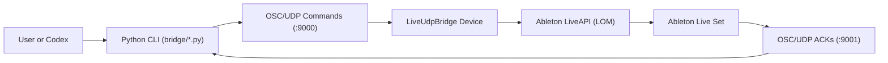

# codex-live-bridge

`codex-live-bridge` is an open-source, local-first Codex-to-Ableton Live
control bridge.

More precisely, this repo ships a Max for Live device, a JavaScript command
router, and Python OSC client/CLI scripts that drive Ableton Live through
LiveAPI (the Live Object Model) over OSC/UDP.

Started during the OpenAI 2026 Hackathon in San Francisco, built in tandem with GPT-5.3-Codex.

This project is independent and is not affiliated with or endorsed by OpenAI,
Ableton, or Cycling '74. All trademarks belong to their respective owners.

This repo can be operated from any Codex surface:
- [Codex app](https://developers.openai.com/codex/app/)
- [Codex CLI](https://developers.openai.com/codex/cli/)
- [Codex IDE extension](https://developers.openai.com/codex/ide/)

Optional workflow docs used by this project:
- [Codex skills](https://developers.openai.com/codex/skills)
- [Codex app automations](https://developers.openai.com/codex/app/automations/)

## Included

- `bridge/m4l/LiveUdpBridge.amxd`: packaged drop-in Max for Live MIDI device
- `bridge/m4l/LiveUdpBridge.maxpat`: editable Max patch source
- `bridge/m4l/live_udp_bridge.js`: JavaScript router logic used by the patch
- `bridge/ableton_udp_bridge.py`: OSC client/CLI for command + ACK flows
- `memory/compositional_memory.py`: memory index loader and fundamental brief CLI
- `memory/retrieval.py`: retrieval index/search/read/brief CLI over memory + eval artifacts
- `memory/eval_governance.py`: bounded eval-to-memory governance loop CLI
- `templates/user-preferences/`: blank user memory and eval template pack

## Live Object Model Control (LiveAPI over OSC/UDP)

The Max for Live device uses LiveAPI (Ableton Live Object Model) and exposes a
generic RPC surface over OSC/UDP. This lets Codex (or any OSC client) query,
set, call, inspect, and enumerate Live Object Model paths and properties.

Current `/api/*` endpoints:

- `/api/ping [request_id]`
- `/api/get <path> <property> [request_id]`
- `/api/set <path> <property> <value_json> [request_id]`
- `/api/call <path> <method> <args_json> [request_id]`
- `/api/children <path> <child_name> [request_id]`
- `/api/describe <path> [request_id]`

Live Object Model reference:
[Cycling '74 Live Object Model docs](https://docs.cycling74.com/max8/vignettes/live_object_model)

## Data & Training

- This repo ships no trained model weights.
- This repo does not implement model training or fine-tuning pipelines.
- This repo does not include or ingest anyone else's music.
- This project does not train on, copy, or emulate other artists' catalogs,
  genres, or styles. It focuses on user-guided, user-owned co-composition,
  helping the user compose in tandem with the software by working from the
  user's own musical material and intent.
- Preference and guidance templates in this repo are intentionally blank at
  clone time; musical direction is user-authored when the user fills those
  docs with their own context, constraints, and goals.
- Steering context comes from user-owned local memory/eval artifacts, not from
  third-party music corpora.
- Any workflow "learning" in this repo refers to optional local logging of your
  own run artifacts (when enabled), not ML training.
- If you are using Codex, that model is external to this repo; this repo is
  the local control and workflow layer around Ableton Live.

## Compositional Studio Assistant Workflow

A template usage pattern in this repo is:

1. Keep track 1 in Ableton Live as `codex-bridge` (control/bridge, no instrument).
2. Put your first instrument on track 2.
3. Treat the track-2 instrument as the first instrument in your ensemble.
4. If needed, put your second instrument on track 3 and treat it as the second ensemble entry.
5. Choose meter, BPM, and optional mood/key, then compose with workflow scripts.
6. Review eval artifacts, adjust constraints/guidance, and compose again.

## Current Composition Architecture

The current public template uses layered decisions:

1. Bridge layer handles OSC transport and Live Object Model command routing.
2. Setup layer establishes tempo, signature, and track/clip state.
3. Pattern layer writes deterministic MIDI content by instrument role.
4. Reflection layer records run metadata for iterative composition.

## Current Eval Coverage

When enabled, eval artifacts focus on symbolic composition structure, not
rendered audio quality.

Current artifact fields include:

- run metadata (`mood`, `key`, `tempo`, `meter`, minutes, bars, section size, status)
- per-track note-count paths and created-clip counts
- structural fingerprints and a fingerprint hash
- similarity/novelty values against recent reference runs
- repetition flags for repeated trajectories

Artifacts are persisted to:

- `memory/evals/compositions/<date>/<run_id>.json`
- `memory/evals/composition_index.json`

If no artifacts exist yet, retrieval/governance commands will report no indexed
context until runs are added.

## Capabilities

Exact bridge command surface available now:

1. `/ping`
2. `/tempo <bpm>`
3. `/sig_num <numerator>`
4. `/sig_den <denominator>`
5. `/create_midi_track`
6. `/add_midi_tracks <count> [name]`
7. `/create_audio_track`
8. `/add_audio_tracks <count> [prefix]`
9. `/delete_audio_tracks <count>`
10. `/delete_midi_tracks <count>` (track 0 protected)
11. `/rename_track <track_index> <name>`
12. `/set_session_clip_notes <track_index> <slot_index> <length_beats> <notes_json> [clip_name]`
13. `/append_session_clip_notes <track_index> <slot_index> <notes_json>`
14. `/inspect_session_clip_notes <track_index> <slot_index>`
15. `/ensure_midi_tracks <target_count>`
16. `/midi_cc <controller> <value> [channel]`
17. `/cc64 <value> [channel]`
18. `/status`
19. `/api/ping [request_id]`
20. `/api/get <path> <property> [request_id]`
21. `/api/set <path> <property> <value_json> [request_id]`
22. `/api/call <path> <method> <args_json> [request_id]`
23. `/api/children <path> <child_name> [request_id]`
24. `/api/describe <path> [request_id]`

ACK behavior:

- The bridge emits OSC acknowledgements using `/ack`.
- For `/api/*`, an optional trailing `request_id` is echoed in ACK responses
  when provided.
- The Python client can listen on the ACK port and print summarized ACK output.

## Topology (Ports and Transport)

- Default host: `127.0.0.1`
- Command channel: UDP `9000`
- ACK/query response channel: UDP `9001`
- The Python client encodes OSC packets using the Python standard library.
- The Max for Live device routes commands to LiveAPI inside
  `bridge/m4l/live_udp_bridge.js`.



## Shipped Workflows

- `bridge/ableton_udp_bridge.py`: general OSC command client/CLI with ACK
  listening and command batching modes
- `bridge/full_surface_smoke_test.py`: full-surface bridge smoke script
- `bridge/benchmark_midi_write.py`: deterministic MIDI write benchmark harness

## Requirements

To run the bridge and workflow scripts:

- Fast start (recommended): Ableton Live 12 Suite 30-day trial (includes Max for Live):
  [Ableton Live trial](https://www.ableton.com/en/trial/)
- Any full setup with Max for Live support also works:
  [Ableton Live](https://www.ableton.com/en/live/) and
  [Max for Live](https://www.ableton.com/en/live/max-for-live/)
- Codex surface (choose one):
  [Codex app](https://developers.openai.com/codex/app/),
  [Codex CLI](https://developers.openai.com/codex/cli/), or
  [Codex IDE extension](https://developers.openai.com/codex/ide/)
- Python 3.10+:
  [python.org downloads](https://www.python.org/downloads/)
- If using Python 3.10, install `tomli` for TOML parsing in memory/eval tools:
```bash
python3 -m pip install tomli
```
- local UDP access on ports `9000` (commands) and `9001` (ack/query responses)
- Host runtime requirement: keep the computer on and awake with Ableton Live
  running, and keep `LiveUdpBridge` loaded on a track while commands are sent.

To edit bridge/device internals:

- For `bridge/m4l/LiveUdpBridge.maxpat`, use the Max for Live editor in Live or
  [Cycling '74 Max](https://cycling74.com/products/max).
- For `bridge/m4l/live_udp_bridge.js`, edit JavaScript source and reload the
  device in Live (this repo does not require a Node.js runtime for this file).

## User Preference Templates (Blank)

- `templates/user-preferences/` includes blank markdown templates for:
  - canon
  - ensemble
  - instruments
  - moods
  - fundamentals (`rhythm`, `harmony`, `timbre`, `velocity`, `key`, `meter`,
    `tempo`, `mood`, `arrangement`, `evaluation`, `silence`)
- These are intentionally empty starter docs and contain no personal project
  preferences.
- First-time setup (required once per clone):

```bash
mkdir -p memory
rsync -a templates/user-preferences/memory/ memory/
```

## Memory and Eval Workflow (Clone-Ready)

After first-time template setup, use this standard flow:

1. Build retrieval index:
```bash
python3 -m memory.retrieval index
```

2. Query context for a run:
```bash
python3 -m memory.retrieval brief --meter <NUM/DEN> --bpm <BPM> --mood <MOOD> --key-name "<KEY>" --focus <FUNDAMENTAL>
```

3. Summarize repeated eval signals:
```bash
python3 -m memory.eval_governance summarize --lookback 30
```

4. Plan safe memory updates (recommended):
```bash
python3 -m memory.eval_governance apply --date YYYY-MM-DD --dry-run
```

5. Apply memory updates (writes files):
```bash
python3 -m memory.eval_governance apply --date YYYY-MM-DD
```

Template docs for eval artifact layout and expected files are included at:
- `templates/user-preferences/memory/evals/README.md`

If you have no eval artifacts yet, summarize/apply commands will report zero
signals until artifacts are added under `memory/evals/compositions/`.

## Compatibility and Stability

- Primary maintainer environment: macOS + Ableton Live with Max for Live.
- Windows and Linux are welcome but not yet validated as first-class maintainer
  environments.
- This project is pre-`1.0.0`; breaking changes may happen between releases.
- Support is best-effort by a solo maintainer.

## Project Files for Contributors

- `CONTRIBUTING.md`: contribution workflow and pull request expectations
- `SUPPORT.md`: support scope and issue-reporting checklist
- `SECURITY.md`: vulnerability reporting guidance
- `CHANGELOG.md`: human-readable release and change history

## Quick Start

1. Clone:
```bash
git clone https://github.com/sunflower-of-parchman/codex-live-bridge.git
cd codex-live-bridge
```

2. In Ableton Live, drag `bridge/m4l/LiveUdpBridge.amxd` onto a MIDI track.

3. Verify bridge connectivity:
```bash
python3 bridge/ableton_udp_bridge.py --ack --status --no-tempo --no-signature --create-midi-tracks 0 --create-audio-tracks 0 --add-midi-tracks 0 --add-audio-tracks 0
```

4. Optional bridge smoke check:
```bash
python3 bridge/full_surface_smoke_test.py
```

## Source Editing

If you modify `bridge/m4l/live_udp_bridge.js` or
`bridge/m4l/LiveUdpBridge.maxpat`:

1. Copy updated JS into your Ableton User Library device folder.
2. Reload the device in Live (remove it from the track, then drag it back in).
3. Re-save `LiveUdpBridge.amxd` from Live/Max.
4. Copy updated `LiveUdpBridge.amxd` back into `bridge/m4l/`.

## Testing

```bash
python3 -m unittest discover -s bridge -p "test_*.py"
```

## License

MIT. See `LICENSE`.
