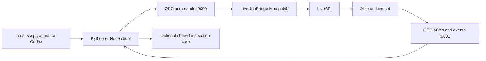

# codex-live-bridge

Current release: [3.2.0](https://github.com/sunflower-of-parchman/codex-live-bridge/releases/tag/codex-live-bridge-v3.2.0)

`codex-live-bridge` is a Max for Live OSC/UDP bridge for Ableton Live. It lets
codex and local scripts inspect a Live set through LiveAPI. A local capability
token also allows controlled changes when you choose to configure one.

The repo ships the editable Max patch and the JavaScript files that run the
bridge. A Python OSC client/CLI sends local commands on UDP `9000` and receives
ACKs or observer events on UDP `9001`.

Started during the OpenAI 2026 Hackathon in San Francisco, built in tandem
with GPT-5.3-Codex.

This project is independent and is not affiliated with or endorsed by OpenAI,
Ableton, or Cycling '74. All trademarks belong to their respective owners.

## How It Fits Together

This repository contains LiveUdpBridge, the standalone external bridge. A Live
Extension and shared inspection core are separate components and are not
included here.


### Responsibilities

| Surface | Responsibility |
| --- | --- |
| **LiveUdpBridge (included)** | External control, observers, LiveAPI, MIDI, writes, and insertion |
| **Live Extension (separate)** | Clip actions, large clip reads, and reports inside Live |
| **Shared inspection core (separate)** | Validate, analyze, report, and compare |

## Requirements

- For LiveUdpBridge, release or Beta Ableton Live with Max for Live support:
  [Ableton Live](https://www.ableton.com/en/live/) and
  [Max for Live](https://www.ableton.com/en/live/max-for-live/)
- A local terminal, or an optional codex surface:
  [Codex app](https://developers.openai.com/codex/app/),
  [Codex CLI](https://developers.openai.com/codex/cli/), or
  [Codex IDE extension](https://developers.openai.com/codex/ide/)
- Python 3.10+
- Node.js for device updates, Python security tests, and JavaScript syntax checks

The separate Live Extension requires Live 12 Suite Beta 12.4.5 or later.
For details, see [Extensions](https://www.ableton.com/en/live/extensions/)
and [join the Live Beta](https://www.ableton.com/en/beta/).

## Quick Start

1. Clone and run the tests:

```bash
git clone https://github.com/sunflower-of-parchman/codex-live-bridge.git
cd codex-live-bridge
python3 -m unittest discover -s bridge -p "test_*.py"
python3 -m unittest discover -s tests -p "test_*.py"
node --check bridge/m4l/live_udp_bridge.js
node --check bridge/m4l/osc_loopback_receiver.js
node --check scripts/ableton-device.js
```

2. Download and extract the packaged Max for Live device:

[Download LiveUdpBridge.zip](https://github.com/sunflower-of-parchman/codex-live-bridge/releases/download/codex-live-bridge-v3.2.0/LiveUdpBridge.zip)

The 3.2.0 release includes the device and both JavaScript runtime files:

```text
LiveUdpBridge.amxd
live_udp_bridge.js
osc_loopback_receiver.js
```

You can also build the device from `bridge/m4l/LiveUdpBridge.maxpat` in a
Live-hosted Max MIDI Effect. Follow `INSTALL.md` for the source-build steps.

3. Keep both JavaScript runtime files next to the device, then load it onto a
MIDI track. Max resolves the LiveAPI router through
`[js live_udp_bridge.js]`. Node for Max runs the loopback-only command
receiver.

4. Verify the bridge with a read-only status command:

```bash
python3 bridge/ableton_udp_bridge.py --ack --status --no-tempo --no-signature
```

Expected ACK shape:

```text
ack:  /ack pong
ack:  /ack status <total_tracks> <midi_tracks> <audio_tracks> <return_tracks> live_set <id>
```

Read-only commands do not require a token. With `--ack`, the client exits with
an error if its reply listener cannot open, a complete matching response does
not arrive, or the bridge reports an error. It does not send the command when
the listener cannot open.

5. Optional: configure a local token for writes and observers:

```bash
export CODEX_LIVE_BRIDGE_TOKEN="$(
  python3 -c 'import secrets; print(secrets.token_urlsafe(32))'
)"
printf '%s\n' "$CODEX_LIVE_BRIDGE_TOKEN"
```

Copy the printed token into the Max `set_auth_token CHANGE_ME_BEFORE_USE`
message, replacing `CHANGE_ME_BEFORE_USE`. Save and reload the local device.
The exported environment variable gives the Python client the same token.
Keep real tokens out of the tracked `.maxpat` source.

The editable `.maxpat` file is the canonical tracked source. Packaged `.amxd`
devices are release artifacts saved from a Live-hosted Max MIDI Effect.

### Update an Installed Device

Stage an updated copy from an existing installed device:

```bash
node scripts/ableton-device.js
```

This command only stages the device and both JavaScript files in a private
temporary directory. It does not change the installed files. Its JSON output
includes `stageDir`, `installed`, `verifiedLive`, `backupDir`,
`tokenConfigured`, and `hashes`.

To update the installation and verify the running Ableton bridge:

```bash
node scripts/ableton-device.js --install --verify-live
```

Installation requires `--install`. It preserves the existing device metadata
and write token. A persistent backup restores the previous files if the
token-free Live status check fails. Staged devices and backups can contain a
configured token. Keep them private and do not commit or upload them. See
`INSTALL.md` for default locations and command options.

## Included Files

- `bridge/m4l/LiveUdpBridge.maxpat`: editable Max for Live patch source
- `bridge/m4l/live_udp_bridge.js`: LiveAPI command router loaded by the patch
- `bridge/m4l/osc_loopback_receiver.js`: dependency-free Node-for-Max receiver
  bound explicitly to `127.0.0.1:9000`
- `bridge/ableton_udp_bridge.py`: Python OSC client/CLI with ACK and listen modes
- `bridge/full_surface_smoke_test.py`: opt-in mutating smoke test for disposable sets
- `scripts/ableton-device.js`: local device staging and opt-in installation
- `bridge/commands.md`: command cheat sheet
- `INSTALL.md`: source export and device loading instructions
- `PROTOCOL.md`: canonical OSC/UDP protocol contract

## Capability Summary

The bridge exposes four command families:

- Core Live set control: `/ping`, tempo, time signature, track create/delete,
  track rename, session clip write/append/inspect, MIDI CC, sustain CC64, and
  `/status`.
- Generic LiveAPI RPC: `/api/ping`, `/api/get`, `/api/set`, `/api/call`,
  `/api/children`, and `/api/describe`.
- Observer lifecycle: `/api_observe`, `/api_unobserve`, `/api_observers`, and
  `/api_clear_observers`, with asynchronous `/ack api_event` payloads.
- Named LiveAPI wrappers: `/api/session_context`, `/api/theory_status`,
  `/api/tuning_status`, `/api/device_list`, `/api/device_parameters`,
  `/api/mixer_status`, `/api/parameter_set`, `/api/insert_device`,
  `/api/insert_chain`, `/api/drum_chain_in_note`, and packet-bounded
  `/api/arrangement_project_inspect`, `/api/arrangement_track_inspect`, and
  `/api/arrangement_clip_inspect`.

Safety classes are documented in `PROTOCOL.md`:

- Read: inspect Live state without mutation.
- Bounded write: set a specific validated value.
- Additive mutation: create tracks, clips, devices, chains, or notes.
- Destructive mutation: delete, clear, overwrite, or reset state.

The generic RPC layer can reach broad LiveAPI behavior. Automation defaults and
examples should favor read commands, bounded writes, explicit request IDs, and
clear user approval for mutations.

Read-only commands are tokenless. Writes, generic calls, observer lifecycle
changes, track and clip mutations, insertion, and MIDI output require the
local capability token through `--auth-token` or
`CODEX_LIVE_BRIDGE_TOKEN`.

## Role In The Hybrid Architecture

`codex-live-bridge` is the public, standalone external automation surface.
It does not require Ableton's Extensions SDK. The Live Extension and shared
inspection core are separate and are not included in this repository.

The broader product architecture assigns responsibilities this way:

- **Bridge:** external and headless automation, persistent observers, generic
  LiveAPI RPC, raw MIDI output, and release-Live compatibility.
- **Extension:** native context actions, large contextual clip reads, modal
  user interface, and future user-invoked undoable transforms.
- **Shared core:** canonical schema validation, note normalization, clip
  inspection, report formatting, and parity comparison across adapters.

The bridge continues to provide the full external automation surface described
in this repository. The Extension provides a native Beta workflow for
contextual, user-invoked tools, while the bridge supports local scripts,
agents, persistent listeners, and Live versions that do not host Extensions.

The protocol 3.1 session clip endpoint supplies the external adapter with
correlated raw facts. Every request has a required request ID, every successful
fragment echoes it, and every encoded response packet is capped at 4096 bytes.
Product-specific interpretation can happen in a separate shared-core consumer
without adding an Extensions SDK dependency to the bridge.

The additive Arrangement surface also supports bounded project, track, and clip
inspection, including return tracks and Main. These read-only requests never
retrieve MIDI notes unless a caller explicitly opts in. Correlated OSC
fragments remain capped at 4096 bytes, and the Python client validates complete
assembly without printing raw note data.

## Protocol Notes

- Default host: `127.0.0.1`
- Command channel: UDP `9000`, active while the Max for Live device is loaded
- ACK/event channel: UDP `9001`, active only while a client is listening
- Structured payloads travel as JSON strings.
- LiveAPI paths use Ableton's zero-based indexes, for example
  `live_set tracks 0`.
- Ableton UI labels are one-based, so UI Track 1 maps to `track_index=0`.
- LiveAPI object IDs are dynamic and should be read per session.

For exact command signatures, ACK shapes, note schema, wrapper behavior, and
Live 12.3 insertion limits, read `PROTOCOL.md`. For quick examples, read
`bridge/commands.md`.


```mermaid
flowchart LR
  U["Local script, agent, or Codex"] --> P["Python or Node client"]
  P --> C["OSC commands :9000"]
  C --> B["LiveUdpBridge Max patch"]
  B --> L["LiveAPI"]
  L --> A["Ableton Live set"]
  A --> R["OSC ACKs and events :9001"]
  R --> P
  P --> S["Optional shared inspection core"]
```

## Python CLI Examples

Read the current set status:

```bash
python3 bridge/ableton_udp_bridge.py --ack --status --no-tempo --no-signature
```

Read Live set tempo through the generic RPC surface:

```bash
python3 bridge/ableton_udp_bridge.py --ack --no-tempo --no-signature \
  --api-get live_set tempo req-tempo
```

List tracks:

```bash
python3 bridge/ableton_udp_bridge.py --ack --no-tempo --no-signature \
  --api-children live_set tracks req-tracks
```

Inspect a session MIDI clip with required request correlation and
packet-bounded fragments:

```bash
python3 bridge/ableton_udp_bridge.py --ack --no-tempo --no-signature \
  --api-session-clip-inspect 0 0 req-clip
```

The endpoint preserves note IDs and release velocity when LiveAPI returns
them. During separate Extensions SDK `1.0.0` qualification, the native SDK
omitted those two fields. Cross-surface consumers must therefore treat note-ID
matching as unavailable and release velocity as an explicit SDK-side gap.

Register and listen for tempo changes after configuring the local token:

```bash
python3 bridge/ableton_udp_bridge.py --ack --listen --listen-timeout 30 \
  --listen-max-events 20 --no-tempo --no-signature \
  --api-observe live_set tempo \
  '{"observer_id":"obs-tempo","emit_initial":true}' req-observe
```

Remove the observer when you are done:

```bash
python3 bridge/ableton_udp_bridge.py --ack --no-tempo --no-signature \
  --api-unobserve obs-tempo req-unobserve
```

Run the full-surface smoke test in a disposable set:

```bash
python3 bridge/full_surface_smoke_test.py --i-understand-this-mutates-live-set
```

The smoke test creates a MIDI track, writes a MIDI clip, and changes tempo and
meter. Use it only when those changes are acceptable.

## Development

If you modify `bridge/m4l/LiveUdpBridge.maxpat` or either JavaScript runtime
file:

1. Keep both JS files next to the patch, or update the Max runtime objects.
2. Reload the device in Ableton Live.
3. Save packaged `.amxd` artifacts from a Live-hosted Max MIDI Effect only
   during an explicit release pass.

Local validation:

```bash
python3 -m unittest discover -s bridge -p "test_*.py"
python3 -m unittest discover -s tests -p "test_*.py"
node --check bridge/m4l/live_udp_bridge.js
node --check bridge/m4l/osc_loopback_receiver.js
node --check scripts/ableton-device.js
python3 -m json.tool bridge/m4l/LiveUdpBridge.maxpat >/dev/null
bash .github/scripts/audit_public_hygiene.sh
```

Live-runtime validation is separate from static validation. Before a release,
package `LiveUdpBridge.amxd` from a Live-hosted Max MIDI Effect and load that
device in Ableton Live. Confirm the command receiver is listening on UDP
`9000`; UDP `9001` opens only while a client is listening. Then check read
wrappers, observer cleanup, bounded parameter writes, and Live 12.3 native
insertion wrappers in a disposable set.

## Data, Training, And Generation Boundary

This repo ships no trained model weights, training pipeline, fine-tuning
pipeline, audio corpus, or generative music model. The bridge itself is not a
generative music system.

The project does not train on, ingest, copy, or emulate artist catalogs,
genres, songs, recordings, or user material. User intent stays user-authored:
the bridge only sends explicit local OSC/LiveAPI commands into Ableton Live.
When a user improves a Live set, that improvement comes from direct editing,
direct commands, or external tools that call the bridge; this repo does not
learn a user profile or improve itself from behavior over time.

## Security Boundary

The OSC bridge uses a local capability token for writes and persistent control.
Read-only inspection remains tokenless. The shipped command receiver binds
explicitly to `127.0.0.1:9000`, and the Python client rejects non-loopback
targets. UDP does not encrypt the token or Live data. The reply client binds
`127.0.0.1:9001` only while it is listening. Treat generic `/api/set` and
`/api/call` commands as powerful local LiveAPI access. Only one ACK-listening
client can bind the default `9001` port at a time.

## Project Docs

- `PROTOCOL.md`: public protocol and safety classes
- `INSTALL.md`: source export and device loading instructions
- `bridge/commands.md`: command examples
- `CONTRIBUTING.md`: contribution process and validation
- `SUPPORT.md`: support scope and issue checklist
- `SECURITY.md`: vulnerability reporting and local runtime boundary
- `CHANGELOG.md`: release history

## License

MIT. See `LICENSE`.
