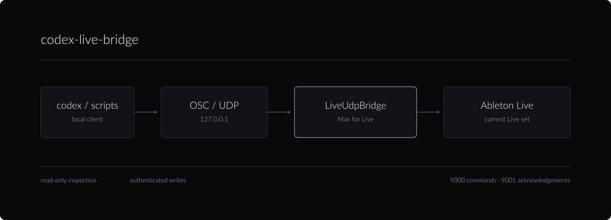
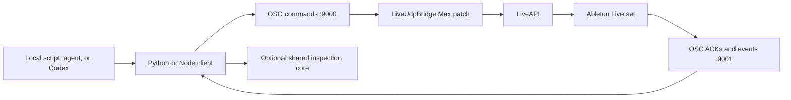

# codex-live-bridge

`codex-live-bridge` is a local-first Max for Live OSC/UDP bridge for
controlling Ableton Live through LiveAPI from local scripts and Codex.

The repo ships the editable Max patch, the JavaScript router loaded by the
patch, and a Python OSC client/CLI. It is designed for a local Ableton Live
session on the same machine, using UDP `9000` for commands and UDP `9001` for
ACKs and observer events.

Started during the OpenAI 2026 Hackathon in San Francisco, built in tandem
with GPT-5.3-Codex.

This project is independent and is not affiliated with or endorsed by OpenAI,
Ableton, or Cycling '74. All trademarks belong to their respective owners.

## How It Fits Together

Two ways to work with Ableton Live use one shared inspection core.



### Responsibilities

| Surface | Responsibility |
| --- | --- |
| **Live Extension** | Clip actions, large clip reads, and reports inside Live |
| **Shared inspection core** | Validate, analyze, report, and compare |
| **LiveUdpBridge** | External control, observers, LiveAPI, MIDI, writes, and insertion |

## Requirements

- Ableton Live with Max for Live support:
  [Ableton Live](https://www.ableton.com/en/live/) and
  [Max for Live](https://www.ableton.com/en/live/max-for-live/)
- A local Codex surface:
  [Codex app](https://developers.openai.com/codex/app/),
  [Codex CLI](https://developers.openai.com/codex/cli/), or
  [Codex IDE extension](https://developers.openai.com/codex/ide/)
- Python 3.10+
- Node.js for syntax-checking the Max JavaScript file during development

## Quick Start

1. Clone and run the tests:

```bash
git clone https://github.com/sunflower-of-parchman/codex-live-bridge.git
cd codex-live-bridge
python3 -m unittest discover -s bridge -p "test_*.py"
python3 -m unittest discover -s tests -p "test_*.py"
node --check bridge/m4l/live_udp_bridge.js
```

2. Export or obtain the loadable Max for Live device:

```text
LiveUdpBridge.amxd
```

Follow `INSTALL.md` to package `LiveUdpBridge.amxd` from the tracked
`bridge/m4l/LiveUdpBridge.maxpat` source. Tagged releases may also provide the
packaged device and adjacent JavaScript router as a `LiveUdpBridge.zip`
download.

3. Keep the JavaScript router next to the exported device so Max resolves `[js
live_udp_bridge.js]`:

```text
bridge/m4l/live_udp_bridge.js
```

4. Verify the local bridge with a read-focused status command:

```bash
python3 bridge/ableton_udp_bridge.py --ack --status --no-tempo --no-signature
```

Expected ACK shape:

```text
ack:  /ack pong
ack:  /ack status <total_tracks> <midi_tracks> <audio_tracks> <return_tracks> live_set <id>
```

The editable `.maxpat` file is the canonical tracked source. Packaged `.amxd`
devices are release artifacts saved from a Live-hosted Max MIDI Effect.

## Included Files

- `bridge/m4l/LiveUdpBridge.maxpat`: editable Max for Live patch source
- `bridge/m4l/live_udp_bridge.js`: LiveAPI command router loaded by the patch
- `bridge/ableton_udp_bridge.py`: Python OSC client/CLI with ACK and listen modes
- `bridge/full_surface_smoke_test.py`: opt-in mutating smoke test for disposable sets
- `bridge/commands.md`: command cheat sheet
- `INSTALL.md`: source export and device loading instructions
- `PROTOCOL.md`: canonical OSC/UDP protocol contract

## Capability Summary

The bridge exposes four command families:

- Core Live set control: `/ping`, tempo, time signature, track create/delete,
  track rename, session clip write/append/inspect, MIDI CC, sustain CC64, and
  `/status`.
- Generic LiveAPI RPC: `/api/ping`, `/api/get`, `/api/set`, `/api/call`,
  `/api/children`, and `/api/describe`.
- Observer lifecycle: `/api_observe`, `/api_unobserve`, `/api_observers`, and
  `/api_clear_observers`, with asynchronous `/ack api_event` payloads.
- Named LiveAPI wrappers: `/api/session_context`, `/api/theory_status`,
  `/api/tuning_status`, `/api/device_list`, `/api/device_parameters`,
  `/api/mixer_status`, `/api/parameter_set`, `/api/insert_device`,
  `/api/insert_chain`, and `/api/drum_chain_in_note`.

Safety classes are documented in `PROTOCOL.md`:

- Read: inspect Live state without mutation.
- Bounded write: set a specific validated value.
- Additive mutation: create tracks, clips, devices, chains, or notes.
- Destructive mutation: delete, clear, overwrite, or reset state.

The generic RPC layer can reach broad LiveAPI behavior. Automation defaults and
examples should favor read commands, bounded writes, explicit request IDs, and
clear user approval for mutations.

## Role In The Hybrid Architecture

`codex-live-bridge` remains the public, standalone external automation surface.
It does not require Ableton's Extensions SDK.

The broader product architecture assigns responsibilities this way:

- **Bridge:** external and headless automation, persistent observers, generic
  LiveAPI RPC, raw MIDI output, and release-Live compatibility.
- **Extension:** native context actions, large contextual clip reads, modal
  user interface, and future user-invoked undoable transforms.
- **Shared core:** canonical schema validation, note normalization, clip
  inspection, report formatting, and parity comparison across adapters.

The bridge continues to provide the full external automation surface described
in this repository. The Extension provides a native Beta workflow for
contextual, user-invoked tools, while the bridge supports local scripts,
agents, persistent listeners, and Live versions that do not host Extensions.

The protocol 3.1 session clip endpoint supplies the external adapter with
correlated raw facts. Every request has a required request ID, every successful
fragment echoes it, and every encoded response packet is capped at 4096 bytes.
Product-specific interpretation can happen in a separate shared-core consumer
without adding an Extensions SDK dependency to the bridge.

## Protocol Notes

- Default host: `127.0.0.1`
- Command channel: UDP `9000`
- ACK/event channel: UDP `9001`
- Structured payloads travel as JSON strings.
- LiveAPI paths use Ableton's zero-based indexes, for example
  `live_set tracks 0`.
- Ableton UI labels are one-based, so UI Track 1 maps to `track_index=0`.
- LiveAPI object IDs are dynamic and should be read per session.

For exact command signatures, ACK shapes, note schema, wrapper behavior, and
Live 12.3 insertion limits, read `PROTOCOL.md`. For quick examples, read
`bridge/commands.md`.


```mermaid
flowchart LR
  U["Local script, agent, or Codex"] --> P["Python or Node client"]
  P --> C["OSC commands :9000"]
  C --> B["LiveUdpBridge Max patch"]
  B --> L["LiveAPI"]
  L --> A["Ableton Live set"]
  A --> R["OSC ACKs and events :9001"]
  R --> P
  P --> S["Optional shared inspection core"]
```

## Python CLI Examples

Read the current set status:

```bash
python3 bridge/ableton_udp_bridge.py --ack --status --no-tempo --no-signature
```

Read Live set tempo through the generic RPC surface:

```bash
python3 bridge/ableton_udp_bridge.py --ack --no-tempo --no-signature \
  --api-get live_set tempo req-tempo
```

List tracks:

```bash
python3 bridge/ableton_udp_bridge.py --ack --no-tempo --no-signature \
  --api-children live_set tracks req-tracks
```

Inspect a session MIDI clip with required request correlation and
packet-bounded fragments:

```bash
python3 bridge/ableton_udp_bridge.py --ack --no-tempo --no-signature \
  --api-session-clip-inspect 0 0 req-clip
```

The endpoint preserves note IDs and release velocity when LiveAPI returns
them. During separate Extensions SDK `1.0.0` qualification, the native SDK
omitted those two fields. Cross-surface consumers must therefore treat note-ID
matching as unavailable and release velocity as an explicit SDK-side gap.

Listen for observer events:

```bash
python3 bridge/ableton_udp_bridge.py --listen --listen-timeout 30 \
  --listen-max-events 20 --no-tempo --no-signature
```

Run the full-surface smoke test in a disposable set:

```bash
python3 bridge/full_surface_smoke_test.py --i-understand-this-mutates-live-set
```

The smoke test creates a MIDI track, writes a MIDI clip, and changes tempo and
meter. Use it only when those changes are acceptable.

## Development

If you modify `bridge/m4l/live_udp_bridge.js` or
`bridge/m4l/LiveUdpBridge.maxpat`:

1. Keep the JS file next to the patch, or update the Max `[js ...]` object.
2. Reload the device in Ableton Live.
3. Save packaged `.amxd` artifacts from a Live-hosted Max MIDI Effect only
   during an explicit release pass.

Local validation:

```bash
python3 -m unittest discover -s bridge -p "test_*.py"
python3 -m unittest discover -s tests -p "test_*.py"
node --check bridge/m4l/live_udp_bridge.js
python3 -m json.tool bridge/m4l/LiveUdpBridge.maxpat >/dev/null
bash .github/scripts/audit_public_hygiene.sh
```

Live-runtime validation is separate from static validation. Before a release,
package `LiveUdpBridge.amxd` from a Live-hosted Max MIDI Effect, load that
device in Ableton Live, confirm UDP `9000` and `9001` are active, then check
read wrappers, observer cleanup, bounded parameter writes, and Live 12.3 native
insertion wrappers in a disposable set.

## Data, Training, And Generation Boundary

This repo ships no trained model weights, training pipeline, fine-tuning
pipeline, audio corpus, or generative music model. The bridge itself is not a
generative music system.

The project does not train on, ingest, copy, or emulate artist catalogs,
genres, songs, recordings, or user material. User intent stays user-authored:
the bridge only sends explicit local OSC/LiveAPI commands into Ableton Live.
When a user improves a Live set, that improvement comes from direct editing,
direct commands, or external tools that call the bridge; this repo does not
learn a user profile or improve itself from behavior over time.

## Security Boundary

The OSC bridge has no authentication. Keep it bound to loopback
`127.0.0.1`, keep ports `9000` and `9001` off untrusted networks, and treat
generic `/api/set` and `/api/call` commands as powerful local LiveAPI access.
Only one ACK-listening client can bind the default `9001` port at a time, so
run the Python and optional shared-core Node clients serially.

## Project Docs

- `PROTOCOL.md`: public protocol and safety classes
- `INSTALL.md`: source export and device loading instructions
- `bridge/commands.md`: command examples
- `CONTRIBUTING.md`: contribution process and validation
- `SUPPORT.md`: support scope and issue checklist
- `SECURITY.md`: vulnerability reporting and local runtime boundary
- `CHANGELOG.md`: release history

## License

MIT. See `LICENSE`.
